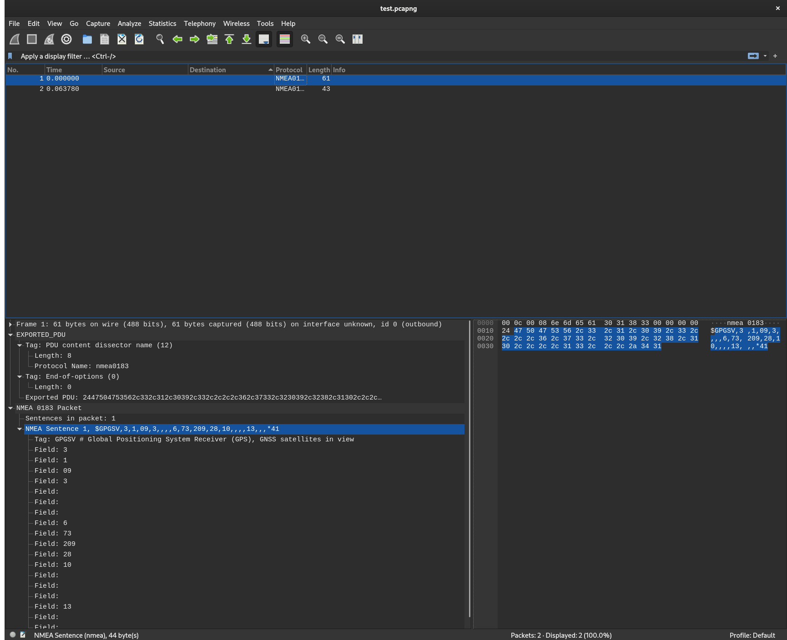

# PCAP experiments

This program generates a PCAP network capture file. It contains two NMEA packets. One inbound and one outbound. 

The dissector name is set to `nmea0183`. This matches with: https://github.com/kmpm/wireshark-nmea

```bash
cargo run 
wireshark -X lua_script:/home/casper/src/wireshark-nmea/nmea0183.lua generated.pcapng
```

## Results
[generated.pcapng](generated.pcapng)

